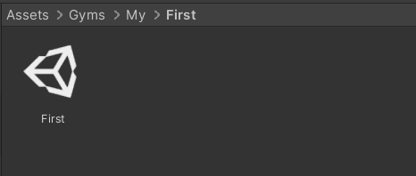

# Unity Gym Creator

You can use the Unity Gym Creator to create Gym templates. Load the Gyms project in Unity. The **GymCreator** folder is located under the **Assets** folder.

Open the GymCreator Scene then click Play in the editor. In the dialog that appears, type the path in which you want to create your level, starting as a sub-folder of the Gyms folder. For example:

The specified path creates two folders called My and First:

The folder created within the Gyms folder contains a scene with the same name as the folder. You can add scripts specific to your Gym here. 

The Dropdown menu let you select which template scene to create. The options are:
- Empty: An empty level.
- Simple Button: A level with a simple button.
- Toggle Button: A level with a toggle button.
- OpenLevel: Two levels connected by an arch.

For more information on the template type and how to use them, refer to [Seting up my first gym](GymFirstSetup.md).

The same folders are created within the Tests folder, which contains a test script named **GymsNameTests** and a **Resources** folder that contains a prefab called **TestObject_GymName.prefab**.

For more information, refer to [Testing Documentation](../../Testing.md).
