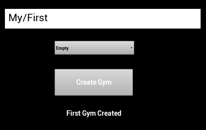
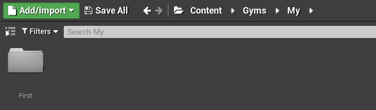
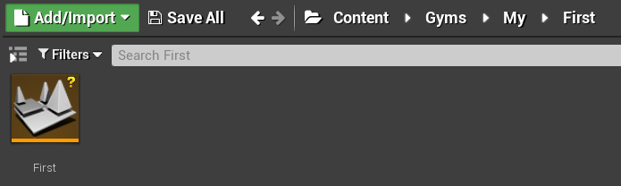

# Unreal Gym Creator

You can use the Unreal Gym Creator to create a Gym template.

## Using the Gym Creator

Open the GymCreator level then click Play. In the dialog that appears, type the path in which you want to create your level, starting as a sub-folder of the Gyms folder. For example:

The specified path creates two folders called My and First:

The folder contains a level with the same name as the folder (in this example, "First").

> Spaces are replaced by underscores (_) in the created folder names.

The Dropdown menu let you select which template map to create. The options are:
- Empty: An empty level.
- Simple Button: A level with a simple button.
- Toggle Button: A level with a toggle button.
- OpenLevel: Two levels connected by an arch.