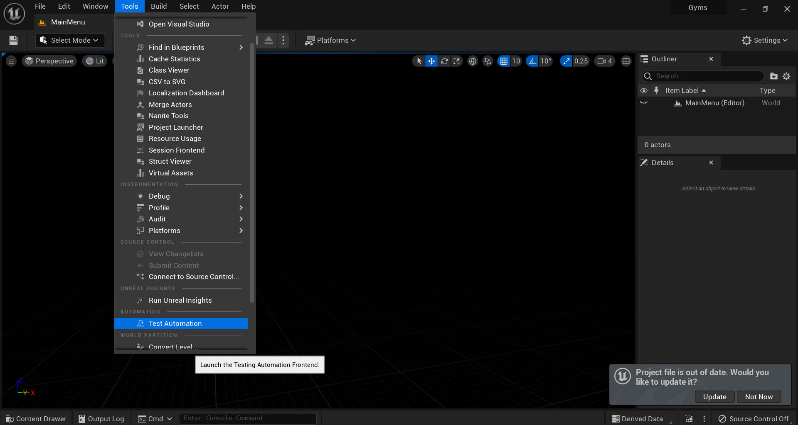

# Testing Gyms

There are two ways to run the Gym tests: with the UnrealAutomation python script or through the Unreal Editor.

## Testing in the Unreal Editor
In Unreal Engine 4, open the Window tab to view the tests.:

    
In Unreal Engine 5, open the Tools tab:

The window shows all available tests. Open the Project folder to view the Gym tests:

Select the tests you want to run then click **Start Tests**.

## Testing with the UnrealAutomation Script

Open a command prompt in the Unreal folder that contains the Unreal project and run the following command:

`python UnrealAutomation.py "-f=Path/To/InputFile" "-u=Path/To/Unreal/Editor/UnrealEditor.exe" "-o=Path/To/OutputFile"`

### Arguments

- -f (InputFile): Can be of any format.
Must follow the syntax of an Input File (see below).
- -u (UnrealEditor.exe): Must be the same Unreal version as the one used to compile the Gyms.
- -o (OutputFile): Can be of any format.
Shows whether a test has passed (True) or failed (False).

This script loads the input file and runs every test named within that file. The results of each tests are written to the output file. For more information about the results of the tests, The Unreal log is saved as **GymsOutput.log**, which is located in the **Saved** folder.

>### Optional Arguments
>- --timeout (-t): The maximum duration of the test in seconds. The run will fail without finishing if it lasts longer than the given value.

## Input File Formatting (for the UnrealAutomation Script)

The input file contains the Gyms and folders you want to run with the automation script. These must be separated by semicolons. There are four types of keyword:

- Example: runs the Gym called "Example".
- \>Example: runs every Gym within the folder "Example" and its sub-folders.
- All: runs every Gyms.
- !Example: skips this specific Gym or folder. Use !\>Example to skip every Gym within the folder **Example**.

Here are some examples of keyword usage:

    Runs the BasicAnimNotify test followed by all tests in the 1-Essential folder:
    BasicAnimNotify;>1-Essential;

    Same as above, but skips the EssentialPostEvent test contained in 1-Essential:
    BasicAnimNotify;>1-Essential;!EssentialPostEvent;

    Runs all the test, but skips anything contained in the 9-Testing folder:    
    All;!>9-Testing

The following examples demonstrate incorrect keyword usage. Avoid using keywords like this:

    Runs all the test, but won't run the tests contained in 1-Essential twice. 
    In other words, the (>1-Essential;) keyword is usless:   
    All;>1-Essential;

    Runs all the text contained in the 1-Essential folder but still skips EssentialPostEvent:
    >1-Essential;!EssentialPostEvent;EssentialPostEvent;

>### Notes
>- An empty input file runs all of the tests.
>- An input file containing only keywords to skip (!Example) is not supported.

## Testing Tips

Each level created with the Gym Creator contains a functional test and a template in the level Blueprint that looks like this:

A Test starts with the **OnTestStart** event and must end with the Finish Test or Finish Open Level Testing node.

> Events and some nodes, such as Latent nodes, can't be used within a function. If your test includes such a function, remove the Tests function and put your tests directly in the Blueprint.

Tests have multiple tools available. 

### Assert Equal

In some tests, you might expect certain values to appear. You can use Assert Equal functions to check for different types of values. These functions are available through a FunctionalTest actor which is included in Gyms created by the Gym Creator.

### Add Expected Log Error
You can create test scenarios that throw errors or warnings. The **Add Expected Log Error** Blueprint function helps to test these cases. This function must be called before the warning/error is thrown. **Expected String Pattern** is a part of the error that is expected to be thrown. **Occurrences** is the number of times the error is expected to appear. If that number is 0, then the error must be thrown at least once for the test to succeed.

### Gyms Game Instance
The **GymsGameInstance** is useful when the test requires a different level to be opened. It has 
a public boolean called **In Testing** and two functions: **StartOpenLevelTesting** and **FinishOpenLevelTesting**. Here is a simple way to use these functions:

### Start Open Level Testing
Start Open Level Testing takes two arguments: the Test Actor and the Level to Open. It sets **In Testing** to true and opens the specified level.

### Finish Open Level Testing
Finish Open Level Testing takes no argument, calls **Finish Test**, and sets **In Testing** to false.

### OpenLevel Testing Logic
To run a test with OpenLevel, we recommend the following sequence:
1. The Test begins at the Event **OnTestStart** and runs the specific actions for the test.

2. **StartOpenLevelTesting** is called and opens the level.
3. The test continues at **BeginPlay** of the next level. It checks whether a test is running with **In Testing** of the **GymsGameInstance**. If a test is running, then the test performs the required steps specific to the test and opens the original level.

4. The previous step occurs on the original map but instead of loading a level, it calls **FinishOpenLevelTesting**.

## OpenLevel Testing Limitation
OpenLevel is limited to a maximum of two OpenLevel calls and the last one must be to the original level.